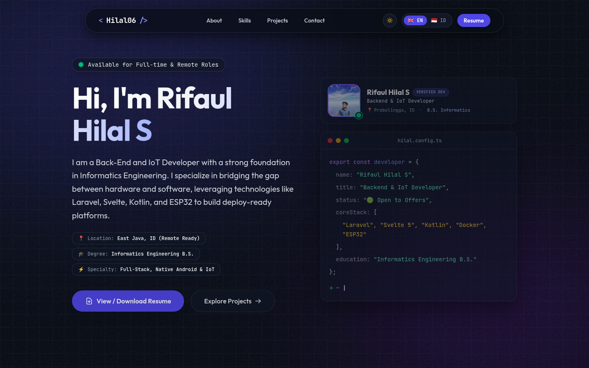
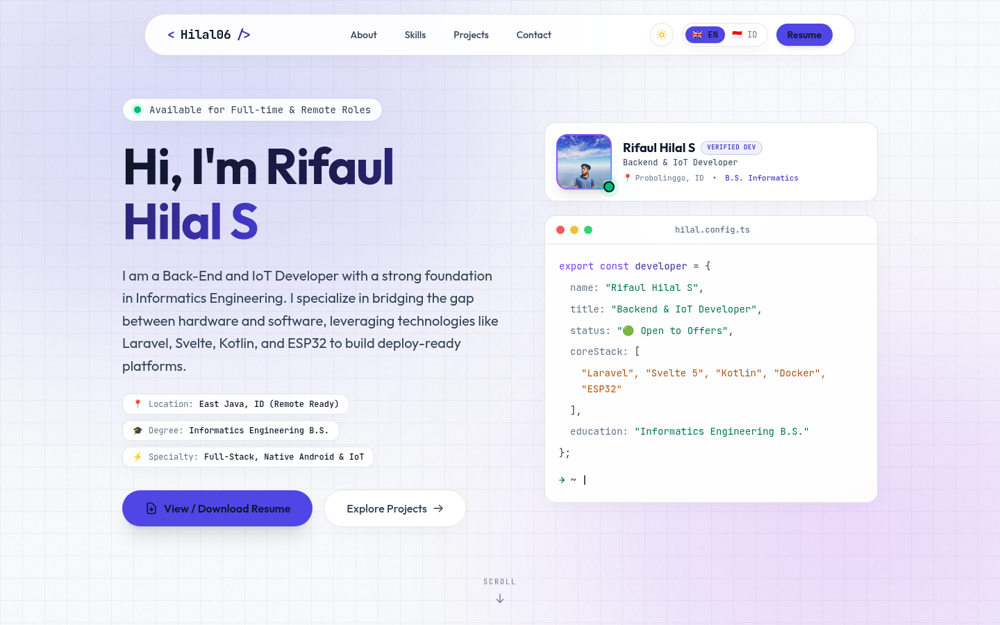

# 🚀 Rifaul Hilal S — Software Engineer Portfolio

[](https://hilal06.github.io)
[](https://svelte.dev)
[](https://tailwindcss.com)
[](https://www.typescriptlang.org/)

A highly interactive, cinematic, and HR-optimized developer portfolio website built with **Svelte 5 (Runes)**, **Vite 8**, and **Tailwind CSS v4**. Designed specifically for **Backend, Native Android (Kotlin), and IoT Engineering** roles, featuring smooth GSAP animations, a bilingual i18n switcher, light & dark mode themes, and transparent project case studies.

---

## 🌐 Live Demo

👉 **[https://hilal06.github.io](https://hilal06.github.io)**

---

## 📸 Preview & Screenshots

<div align="center">

### 🌙 Dark Mode (Default IDE Obsidian Theme)


### ☀️ Light Mode (Clean Slate Theme)


</div>

---

## ✨ Key Features & HR UX Optimizations

- **⚡ Svelte 5 Runes Architecture:** Built exclusively with Svelte 5 reactive primitives (`$state`, `$derived`, `$effect`, `$props`).
- **🌐 Bilingual i18n Switcher (EN / ID):** Instant one-click language toggle (`🇬🇧 EN` | `🇮🇩 ID`) with persistent `localStorage` preference.
- **☀️ Light & Dark Mode Toggle:** Fully customizable theme switcher with WCAG AA compliant contrast colors in both dark obsidian and light slate modes.
- **🎯 Recruiter / HR Snapshot Widget:**
  - Active status indicator (`🟢 Available for Full-time & Remote Roles`).
  - Candidate quick info cards: Location (*East Java, ID*), Degree (*Informatics Engineering B.S.*), and Specialty (*Full-Stack, Native Android & IoT*).
  - Verified Developer Photo Frame (`public/avatar.jpg`) with graceful fallback.
  - Interactive terminal snippet (`hilal.config.ts`).
- **💼 1-Click PDF Resume Modal:** Integrated CV viewer modal with direct PDF download button (`public/resume.pdf`).
- **📁 Structured Project Showcase:**
  - Multi-category domain filtering (`Android & Mobile`, `Full Stack`, `IoT & Embedded`, `Open Source`).
  - IDE-styled detail popup modal featuring image gallery carousels, key architectural highlights, tech stack tags, and transparent Public/Private repo status.
  - Isolated background scrolling with Lenis scroll lock (`data-lenis-prevent`).
- **🔄 Live GitHub REST API Integration:** Dynamic repository statistics sync with fallback mechanisms.
- **✉️ Direct Contact Form:** Powered by [Web3Forms](https://web3forms.com/) with a 1-click email copy widget (`rifaulhilal06@gmail.com`).

---

## 🛠️ Technical Ecosystem & Tech Stack

| Category | Primary Technologies |
| :--- | :--- |
| **Backend & Cloud** | Laravel, PHP, NodeJS, Python, Supabase, PostgreSQL, MySQL, REST APIs, RabbitMQ |
| **Mobile Native** | Kotlin, Jetpack Compose (M3), Room SQLite DB, Android SDK, Coroutines & Flow |
| **IoT & Embedded** | ESP32 / ESP8266, Arduino C++, MQTT Protocol, Node-RED, Grafana |
| **DevOps & Linux** | Docker, Ubuntu / Fedora Server, Bash Scripting, TUI Automation, Git |
| **Frontend Web** | Svelte 5, React (Inertia.js), TypeScript, Tailwind CSS v4, Vite 8, GSAP 3, Lenis |

---

## 🚀 Getting Started

### Prerequisites

- **Node.js**: v18.0 or higher
- **npm** / **yarn** / **pnpm**

### Installation & Local Setup

1. **Clone repository:**
   ```bash
   git clone https://github.com/Hilal06/Hilal06.github.io.git
   cd Hilal06.github.io
   ```

2. **Install dependencies:**
   ```bash
   npm install
   ```

3. **Run local development server:**
   ```bash
   npm run dev
   ```
   Open `http://localhost:5173` in your browser.

4. **Verify TypeScript & Svelte type safety:**
   ```bash
   npm run check
   ```

5. **Build production bundle:**
   ```bash
   npm run build
   ```

---

## 📂 Project Structure

```text
Hilal06.github.io/
├── public/
│   ├── avatar.jpg              # Personal profile photo
│   ├── resume.pdf              # Curriculum Vitae PDF
│   └── projects/               # Case study preview images
├── screenshots/
│   ├── preview-dark.png        # Dark mode README preview
│   └── preview-light.png       # Light mode README preview
├── src/
│   ├── components/             # Svelte UI components (Hero, About, Projects, etc.)
│   ├── data/
│   │   ├── profile.json        # Candidate bio & contact information
│   │   └── projects.json       # Featured portfolio case studies
│   ├── lib/
│   │   ├── i18n.ts             # Bilingual translation store (EN / ID)
│   │   ├── theme.ts            # Light / Dark mode theme switcher
│   │   └── github.ts           # GitHub REST API fetcher
│   ├── app.css                 # Tailwind CSS v4 @theme configuration & Light Mode overrides
│   └── App.svelte              # Main application root
```

---

## 📄 License

This project is open-source and available under the [MIT License](LICENSE).
